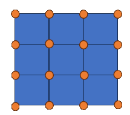

# Tile layout

Manic Miner organizes the map layout into tiles. Each is a square space and the tiles are organized into a rectangular shape of rows (tall) and columns (width).  Each tile has four corners, each having a height. Adjacent tiles share their corners and thus their heights.

The above 3x3 map has a total of 9 tiles and 12 heights.

The tiles around the edges are border tiles and there are 8 border tiles. By default these will be solid rock regular (38). There are 12 border heights with default values of 0.

The tile in the middle is the only playable tile in the map.

> The playable size of a map is rows-2, cols-2 so in this case 1x1.

Maps are organized such at 0,0 is the upper left and 2,2 is the lower right. So the coordinate of the playable tile is 1,1.

When using the map editor, you can spin and move the camera around so 0,0 is no longer the upper left of the map. This is just a point of view. Where the 0,0 tile is within the map file never changes.

The map layout has the following sections related to tiles
- tiles section
- height section
- resource section

The resource section has two subsections, a crystal: and ore: sections.

tiles, crystal, ore sections all have the same layout. One entry per tile, there are rows,cols values, in the range from 0,0 upper left to rows-1, cols-1 lower right.

height has a slightly different layout since there is an entry per vertex. Look at the picture, the dots are the vertexes. The upper left is 0,0 and the lower right is 3,3

## Order of coordinates.
Manic Miners works with row,col (Y,X) pairs. This may confuse anyone that is used to traditional graphics X,Y ordering.

## Manic Miner scripting documentation
The Manic Miner script documentation is also the reference documentation for the map file layout.

[Manic Miner File Format](https://manicminers.github.io/docs/#/_pages/DATFileFormat)

### Links
- [Back to Overview](README.md)
